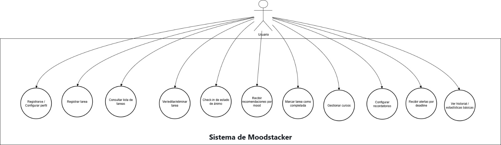
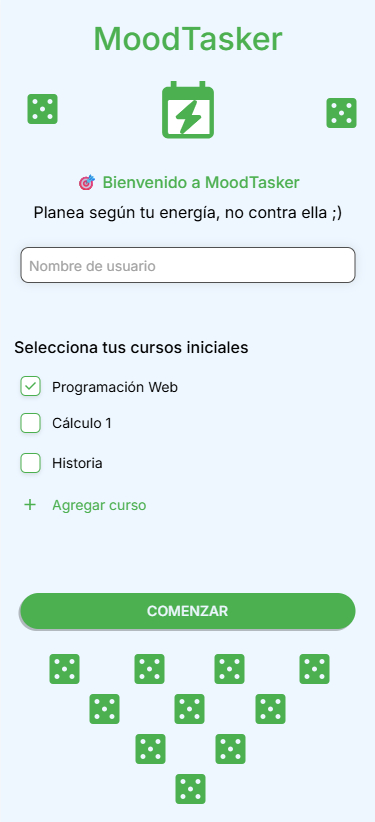
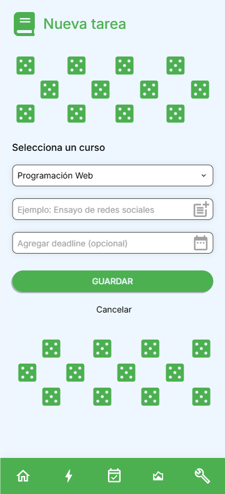
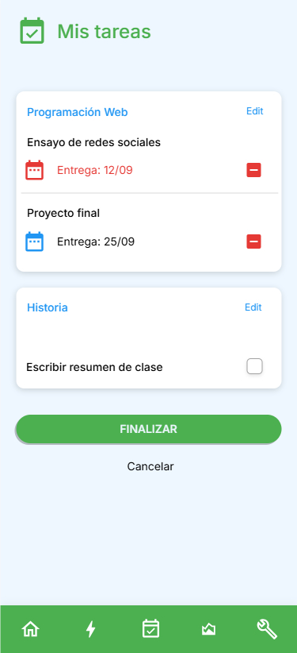
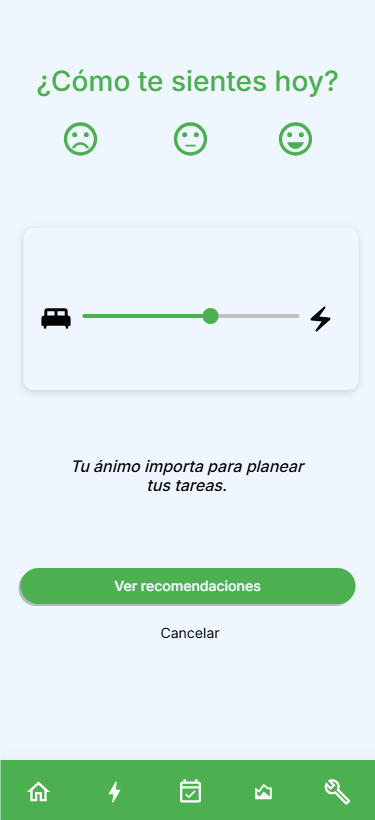
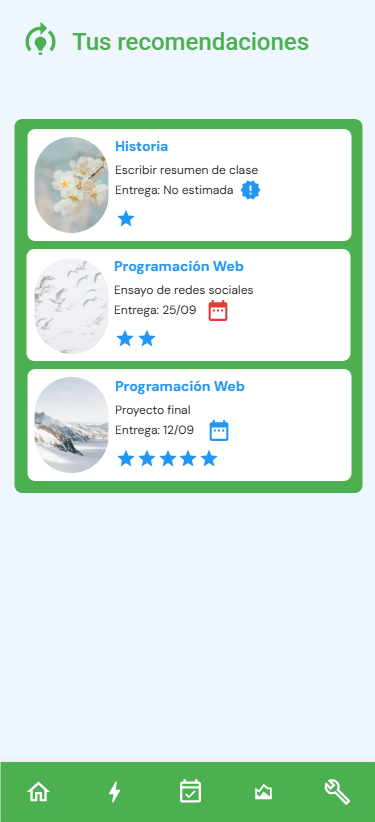
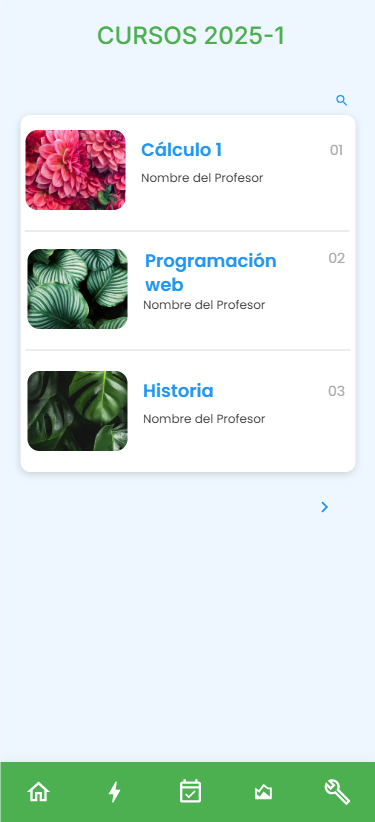
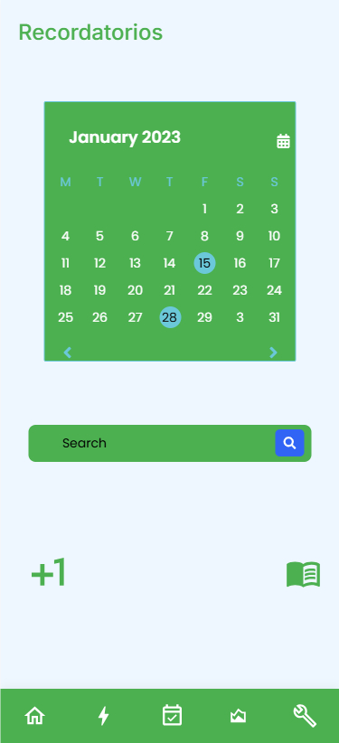
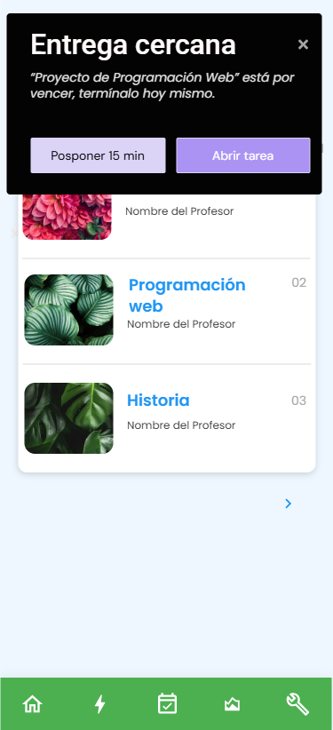

# 2025-2 Programación Móvil - MoodTasker App  
## Planificador según tu energía/motivación 

MoodTasker es una aplicación móvil desarrollada en **Flutter**, pensada para estudiantes universitarios que suelen procrastinar y buscan una forma más sencilla de organizar sus tareas.  

En lugar de planificar por horas fijas, MoodTasker permite registrar tareas rápidamente (curso + título + fecha opcional) y luego sugiere cuáles realizar según el estado de ánimo o nivel de energía del estudiante.  

De esta forma, cuando el usuario se siente motivado, la app le recomienda tareas más pesadas; y cuando tiene poca energía, le sugiere tareas ligeras que pueda completar rápido.  

---

## ⚙️ Configuración del Ambiente de Desarrollo  

### 🖥️ Requisitos previos
- Instalar Android Studio: Este nos permitira a su vez instalar el SDK de Android, que permite conectar el codigo con el sistema operativo y hace posible crear y ejecutar la aplicacion de manera local o en un equipo virtual. 
> *Figura 1: Instalación de Android Studio*

 

- Instalar la herramienta [Flutter SDK](https://docs.flutter.dev/get-started/install).  Esta nos permite contar con las herramientas y librerias que permiten compilar y ejecutar la aplicacion.    
> *Figura 2: Instalación de Flutter*

- Configuracion del path de Flutter: De esta manera tendremos la ruta definida en el sistema operativo para poder emplear la terminal de comandos desde Visual Studio Code o CMD y emplear los comandos propios de Flutter.  
> *Figura 3: Configuracion de Path*

 

- Instalacion de Ruby: se utiliza para desarrollar el backend de la aplicación, permitiendo gestionar la lógica del servidor, procesar datos y establecer la comunicación entre la aplicación móvil y la base de datos.
> *Figura 4: Instalación de Ruby*

 

## 🗂️ Diagrama de Despliegue  

En esta primera versión, toda la lógica y los datos se manejan **de forma local** en el dispositivo móvil.  

- **Usuario** → **App Flutter** (UI + lógica de recomendación)  
- **Almacenamiento** → SQLite o Shared Preferences para persistir tareas y estados de ánimo  

👉 **Futuro**: integración con la nube para sincronización entre dispositivos.  

> *Figura 5: Diagrama de despliegue*  

---

## ✅ Requerimientos No Funcionales  

1. **Compatibilidad**  
   - La aplicación desarrollada en Flutter debe funcionar tanto en **Android** como en **iOS**.  

2. **Disponibilidad**  
   - La app debe poder usarse **offline**, sin requerir conexión a internet.  

3. **Usabilidad**  
   - El registro de una tarea no debe tomar más de **5 segundos** (curso + título + deadline opcional).  

4. **Rendimiento**  
   - La generación de la lista de recomendaciones no debe superar **1 segundo**, incluso con hasta 200 tareas registradas.  

5. **Privacidad**  
   - Todos los datos del usuario se almacenan **localmente** en el dispositivo. No se requieren cuentas ni almacenamiento en la nube en esta versión.  

6. **Mantenibilidad**  
   - El código debe estar estructurado de manera modular en Flutter, siguiendo buenas prácticas de arquitectura (por ejemplo: separación por capas).  

---

## Diagrama de Casos de Uso

En **MoodTasker**, el objetivo es reducir fricción: el estudiante registra sus tareas en segundos y, cuando lo necesita, obtiene sugerencias acordes a su energía actual. El **Usuario** es el actor principal y puede: configurar su perfil básico (nombre y cursos), registrar tareas con el mínimo de campos, consultar su lista completa, realizar un **check-in** de estado de ánimo para recibir **recomendaciones** priorizadas, y marcar avances. El sistema aplica reglas internas para estimar dificultad/energía sin pedir datos extra y envía recordatorios locales cuando se acercan plazos.

*A continuación se listan los casos de uso principales:*

| ID   | Caso de Uso                           | Descripción |
|------|----------------------------------------|-------------|
| UC1  | Registrarse / Configurar perfil        | El usuario define su **nombre** y selecciona sus **cursos** iniciales (config local, sin cuentas). |
| UC2  | Registrar tarea                        | Crea una tarea indicando **curso** y **título** (+ **deadline** opcional). |
| UC3  | Consultar lista de tareas              | Visualiza todas las tareas pendientes, ordenadas (p. ej., por deadline o curso). |
| UC4  | Ver/editar/eliminar tarea              | Accede al detalle para **editar** título/curso/fecha o **eliminar** la tarea. |
| UC5  | Check-in de estado de ánimo            | Indica cómo se siente (baja, neutra, motivada) mediante un selector simple. |
| UC6  | Recibir recomendaciones por mood       | Obtiene una lista priorizada según **mood** y la **dificultad/energía inferida**. |
| UC7  | Marcar tarea como completada           | Actualiza el estado de la tarea al finalizarla y refleja el progreso. |
| UC8  | Gestionar cursos                       | Agrega/edita/elimina cursos desde ajustes del perfil. |
| UC9  | Configurar recordatorios               | Activa/desactiva **notificaciones locales** para deadlines y check-ins. |
| UC10 | Recibir alertas por deadline           | La app envía avisos cuando se aproxima la **fecha de entrega** de una tarea. |
| UC11 | Ver historial/estadísticas básicas     | Consulta moods recientes y conteo de tareas completadas (resumen simple, local). |

---

## Diagrama de Clases

El modelo de **MoodTasker** es local y minimalista. Se centra en Usuario, Cursos, Tareas, Subtareas, registros de estado de ánimo (MoodLog) y Settings.

### 🔹 Enumeraciones
- **EstadoTarea**: `PENDIENTE`, `EN_PROGRESO`, `COMPLETADA`
- **MoodLevel**: `BAJA`, `NEUTRA`, `ALTA`

### 🔹 Clases y atributos principales
**Usuario**
- `id: String`
- `nombre: String`
- `createdAt: DateTime`

**Settings**
- `id: String`
- `usuarioId: String` *(FK → Usuario.id, único)*
- `notifsEnabled: bool = true`
- `checkinReminderDaily: bool = false`
- `checkinReminderHour: int?` *(0–23)*
- `deadlineAlerts: bool = true`

**Curso**
- `id: String`
- `nombre: String`
- `usuarioId: String` *(FK → Usuario.id)*

**Tarea**
- `id: String`
- `cursoId: String` *(FK → Curso.id)*
- `titulo: String`
- `deadline: DateTime?`
- `dificultadEstimada: int` *(1..5, **derivado por reglas**)*
- `energiaRequerida: int` *(1..5, **derivado por reglas**)*
- `estado: EstadoTarea = PENDIENTE`
- `createdAt: DateTime`
- `updatedAt: DateTime`

**MoodLog**
- `id: String`
- `usuarioId: String` *(FK → Usuario.id)*
- `fechaHora: DateTime`
- `mood: MoodLevel`

### 🔹 Relaciones
- **Usuario 1 — 1 Settings**
- **Usuario 1 — * Curso**
- **Curso 1 — * Tarea**
- **Usuario 1 — * MoodLog**

### 🔹 Reglas e inferencias

- **Título obligatorio**: no puede estar vacío.  
- **Deadline**: opcional; si existe, influye en la recomendación.  
- **Estado por defecto**: `PENDIENTE` para nuevas tareas.  
- **Dificultad/Energía**: se calculan automáticamente con reglas sencillas:

#### 📌 Palabras clave en el título
- **Alta (4–5)**  
  - Contiene: *ensayo*, *exposición*, *proyecto*, *informe*  
- **Media (3)**  
  - Contiene: *tarea*, *ejercicios*, *práctica*  
- **Baja (1–2)**  
  - Contiene: *lectura*, *resumen*, *repaso*  

#### ⏰ Cercanía del deadline
- Si la entrega es en **≤ 24 horas**, subir un nivel de dificultad/energía respecto al valor base.  
- Si faltan varios días, se mantiene el valor calculado por palabras clave.  

El diagrama de clases es el siguiente:

 

---
## Prototipos

En función a los casos de uso se proponen los siguientes prototipos:

> *Figura 6: UC1: Registrarse / Configurar perfil*  

---

> *Figura 7: UC2: Registrar tarea*  

---

> *Figura 8: UC3: Consultar lista de tareas*  

---
> *Figura 9: UC4: Ver/editar/eliminar tarea*  

---
> *Figura 10: UC5: Check-in de estado de ánimo*  

---
> *Figura 11: UC6: Recibir recomendaciones por mood*  

---
> *Figura 12: UC7: Marcar tarea como completada*  

---
> *Figura 13: UC8: Gestionar cursos*  

---
> *Figura 14: UC9: Configurar recordatorios*  

---
> *Figura 15: UC10: Recibir alertas por deadline*  

---
> *Figura 16: UC11: Ver historial/estadísticas básicas*  

